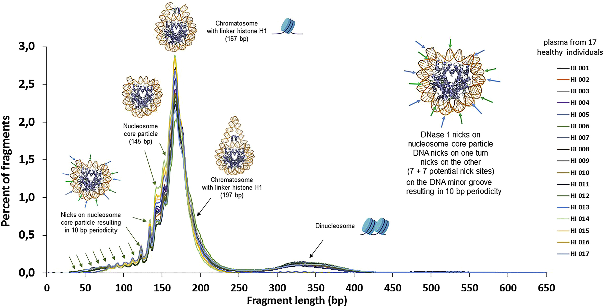
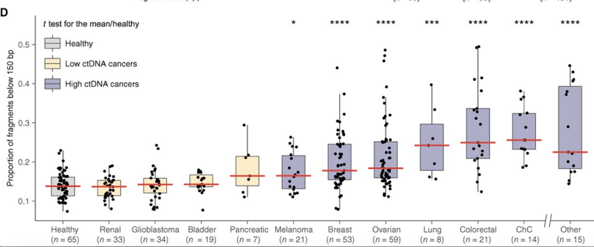
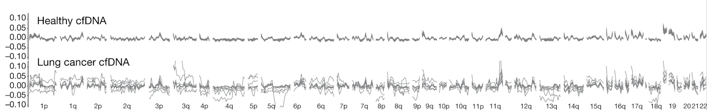
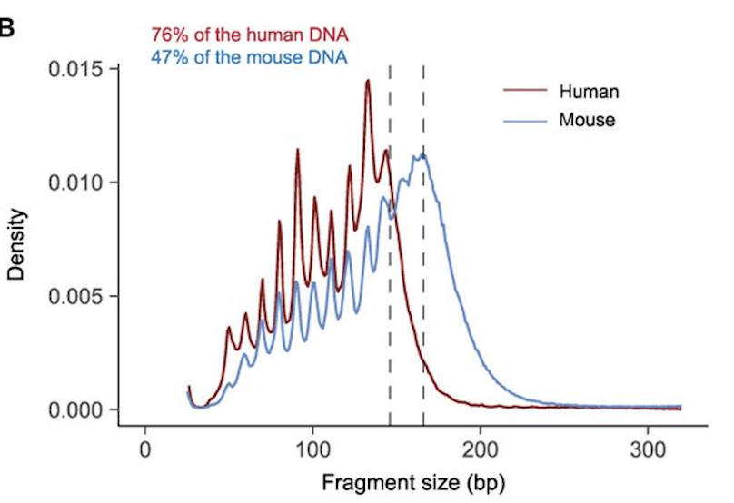
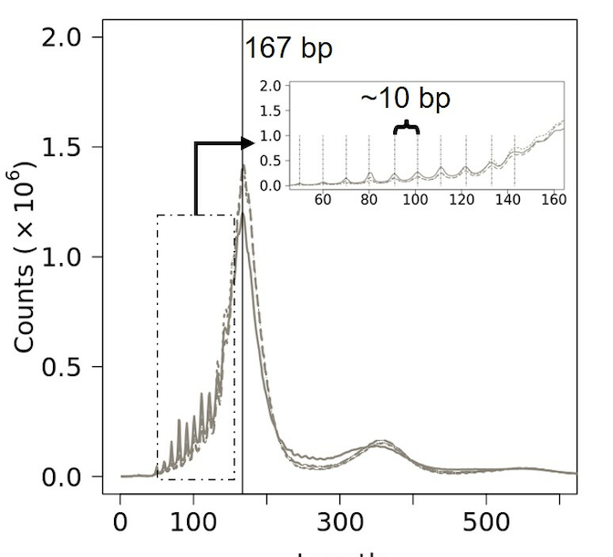

Detecting Cancer from Blood Samples
================
Solon Karapanagiotis –
Sep 2025

# Liquid biopsies and cell-free DNA

There is increasing interest in using **extracellular DNA** present in
bodily fluids to gather diagnostic information. These approaches are
often referred to as **liquid biopsies**, as they offer insights that
previously required invasive tissue biopsies. At present, three main
types of liquid biopsies are at the forefront:

1.  Detection of fetal DNA in the plasma of pregnant women.

2.  Detection of circulating tumor DNA (**ctDNA**) in the blood of
    cancer patients (the focus of this challenge).

3.  Detection of donor-derived DNA in the blood of transplant
    recipients.

Cell-free nucleic acids, including **cell-free DNA (cfDNA)**, enter the
bloodstream when cells die, either as part of normal turnover or due to
disease. In healthy individuals, most cfDNA in blood originates from
blood cells. However, when a specific organ or tissue experiences
pathological cell death, increased amounts of cfDNA from that tissue are
released into circulation. Essentially, blood cfDNA is a mosaic of
fragmented DNA from various tissues throughout the body.

Emerging research indicates that cfDNA fragmentation is not entirely
random. This realization has led to the rise of **fragmentomics**, the
study of the physical and biological properties of cfDNA fragments,
which can reveal valuable diagnostic information. The figure below
illustrates the cfDNA fragment length distribution for 17 healthy
individuals, highlighting several distinctive features and their
underlying biological processes.

Fragment length distribution of cfDNA in healthy individuals. Most
fragments are around 166 base pairs (bp). A bp is a unit of measurement
for DNA length, representing two nucleotides bonded together across the
double helix.

# cell-free DNA in cancer patients

Importantly, the profiles of cfDNA fragments differ between individuals
with and without cancer:

1.  cfDNA fragments from healthy individuals are usually around 166 bp
    long. Most fragments fall within 150–200 bp. cfDNA fragments from
    cancer patients tend to be shorter, with a higher proportion under
    150 bp. cfDNA from cancer patients may also show a higher proportion
    of fragments longer than 180 bp.

The figure above presents an illustrated comparison of the fragment size
distributions of a cancer patient (black line) and that of the mean of
17 healthy individuals (blue line). Vertical lines indicate fragment
lengths where the mean size profile curve of cfDNA from healthy
individuals crosses that of the cancer patient cfDNA. Inset: zoom on the
240–480 bp size range. Compared with the healthy mean, the cancer
patient size profile has an increased number of fragments in the 40–151
and 218–320 bp ranges.

Proportion of cfDNA fragments below 150 bp by cancer type.

2.  Fragment length variation can be position-dependent within the
    genome.

Genome-wide cfDNA fragmentation profiles (defined as the ratio of short
to long fragments) for 30 healthy individuals (top) and 8 patients with
lung cancer (bottom).

3.  The size profile of these shorter fragments often exhibits increased
    10-bp oscillation amplitude in the 90–145 bp range in cancer
    patients.

4.  Shorter periodicities in cfDNA fragmentation in cancer patients have
    also been reported.

These observations have motivated studies exploring how cfDNA fragment
length properties can be used to classify cfDNA samples from patients
with cancer and healthy individuals.

# Glossary of Terms

- Solid tumors: abnormal masses of tissue that arise from uncontrolled
  cell growth in a specific organ or tissue, forming a solid lump, as
  opposed to cancers of the blood (like leukemia) which are non-solid

- Mutations: changes in the DNA sequence of a cell’s genome.

- Extracellular DNA: DNA that exists outside of cells in bodily fluids
  or the extracellular environment. It can originate from cell death
  processes (apoptosis, necrosis), active secretion, or release from
  microorganisms, and is not contained within intact cells. In humans,
  extracellular DNA is found in blood plasma, urine, saliva, and other
  bodily fluids, where it can serve as a biomarker for physiological or
  pathological conditions, such as cancer, pregnancy, or organ
  transplant rejection.

- Liquid biopsy: A minimally invasive technique for detecting and
  monitoring cancer by analyzing non-solid biological tissue, primarily
  blood, to assess tumor-derived material.

- Tissue biopsy: A traditional procedure involving the surgical removal
  of tissue samples from the body to diagnose/stage diseases such as
  cancer.

- Analyte: A substance or chemical constituent that is subject to
  analysis, such as cell-free DNA or cell-free RNA in the context of
  liquid biopsies.

- Cell-free DNA (cfDNA): Short fragments of DNA found in the
  bloodstream, typically released from dying (apoptotic or necrotic)
  cells.

- Circulating tumour DNA (ctDNA): A subset of cfDNA that originates from
  cancerous tumor cells, containing mutations or alterations specific to
  the tumor.

- Fragmentomics: The study of the physical and biological
  characteristics of cfDNA fragments, such as size and structural
  patterns, used to enhance diagnostic accuracy.

- Fragment size distribution: The variation in lengths of cfDNA
  fragments, which can differ between tumor-derived and non-tumor cfDNA.
